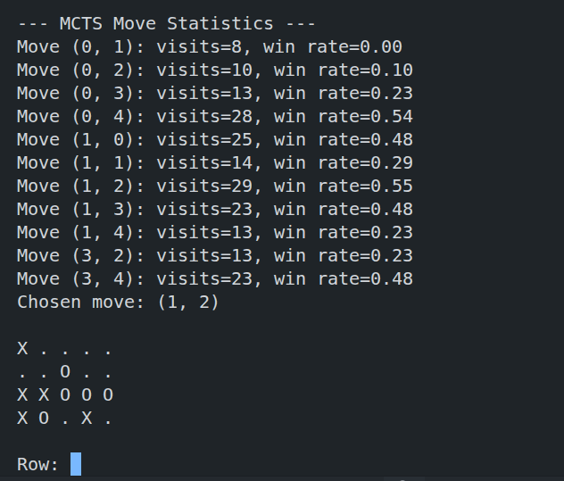
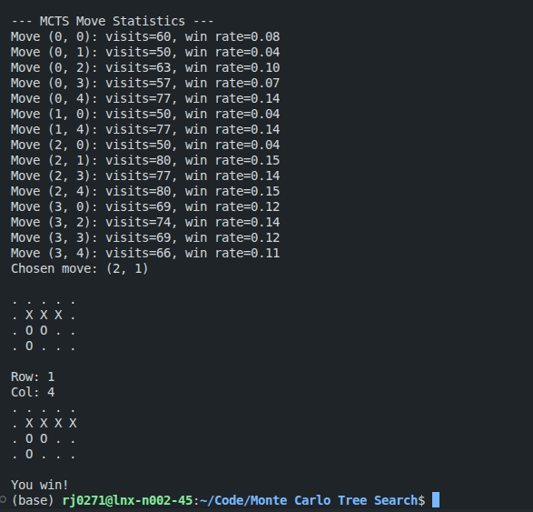
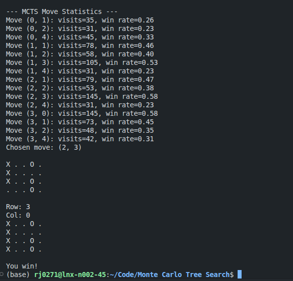

# Lab task responses

## Part 1

### Step 1

> Does the agent seem random or purposeful?

Purposeful! It keeps accurately countering the moves I try to make.

> Does it ever miss obvious wins or blocks?

No, it's pretty good at blocking me.

Apart from one point where it failed to block my win:

> How does its behaviour change as the game progresses?

At the start of the game, its moves seem random. But after a few moves it starts to try getting
4 in a row.

### Step 2

> Which moves are explored most often?

The ones with higher win rates get explored more often!

> Do some moves have high win rates but few visits?

Not that I've noticed - win rate seems to be strongly correlated with number of visits.

> Why might MCTS still choose a move with a lower win rate?

### Step 3

- Selection - `leaf = select(root)`
- Expansion - `expand(leaf)`
- Simulation - `winner = simulate(leaf.board, leaf.player)`
- Backpropagation - `backpropagate(leaf, winner)`

## Part 2

I increased the simulations count to 1,000 and it quite simply gave me a free win:

